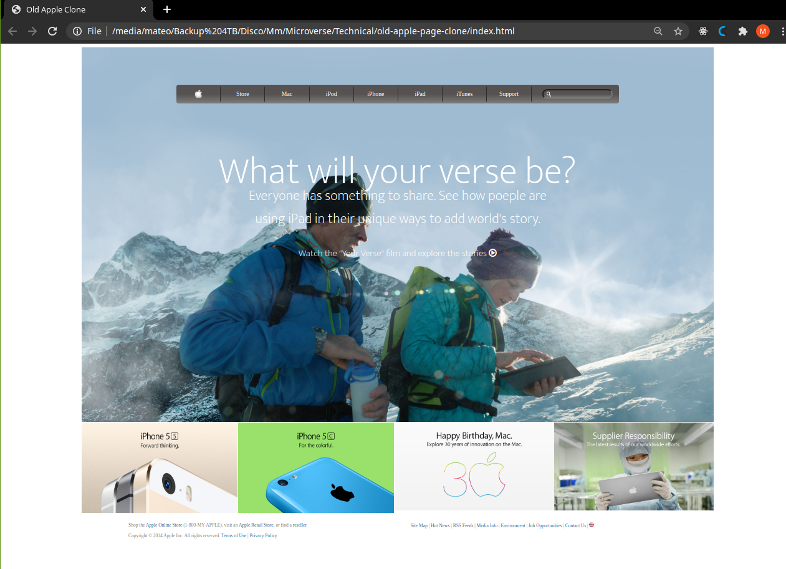

# Apple Old Page Clone Page

> The objective of this project was to recreate this [Apple Page](https://web.archive.org/web/20140301004610/http://www.apple.com/)

The whole project was the fourth on the microverse HTML/CSS curriculum created using CSS positioning, FLEX and Grid for some elements.

## Built With

- HTML, CSS.
- No frameworks,
- Flex, Grid, Gradient

## Live Demo

[Live Demo Link](https://raw.githack.com/ABDELLANI-Youcef/old-apple-page-clone/old_apple/index.html)

## Authors

👤 **Mateo mojica**

- Github: [@mateomh](https://github.com/mateomh)
- Twitter: [@mateo_m_h](https://twitter.com/mateo_m_h)
- Linkedin: [linkedin](https://linkedin.com/mateo_mojica_hernandez)

👤 **Youcef ABDELLANI**

- Github: [@ABDELLANI-Youcef](https://github.com/ABDELLANI-Youcef)
- Twitter: [@YoucefAbdellani](https://twitter.com/YoucefAbdellani)
- Linkedin: [linkedin](https://www.linkedin.com/in/youcef-abdellani-b79361124/)

## 🤝 Contributing

Contributions, issues and feature requests are welcome!

Feel free to check the [issues page](issues/).

## Show your support

Give a ⭐️ if you like this project!

## Acknowledgments

- Web Archive
- CSS Tricks page
- Odin Project

## 📝 License

This project is [MIT](lic.url) licensed.